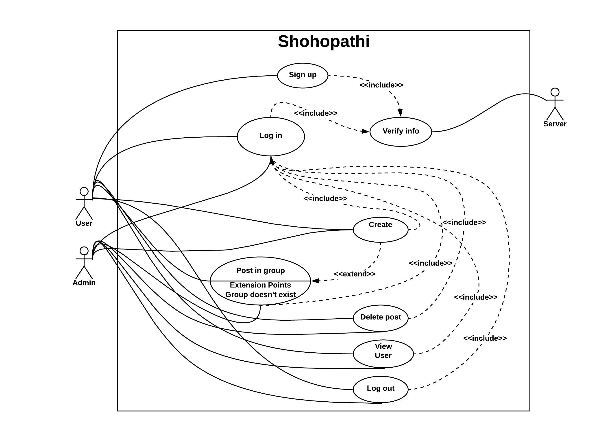
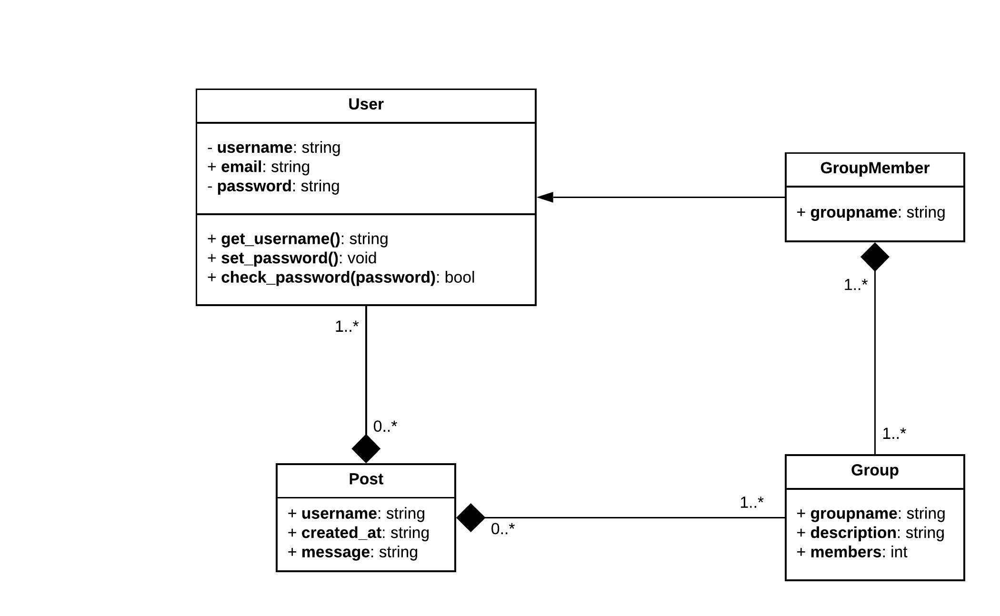
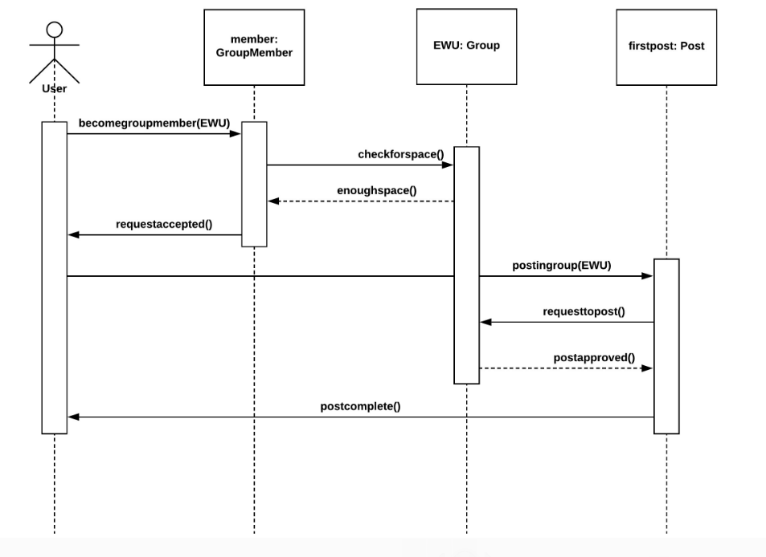
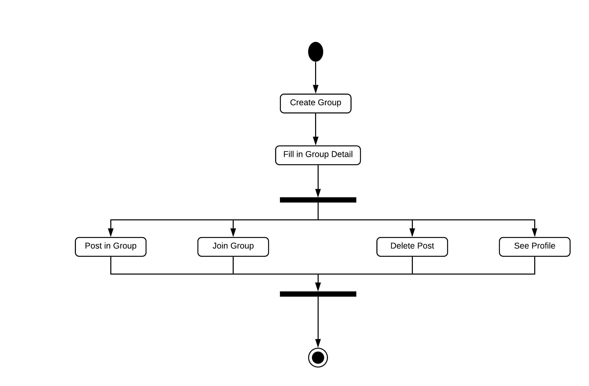
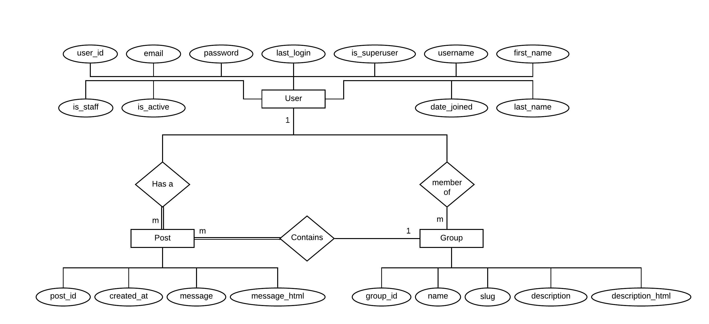
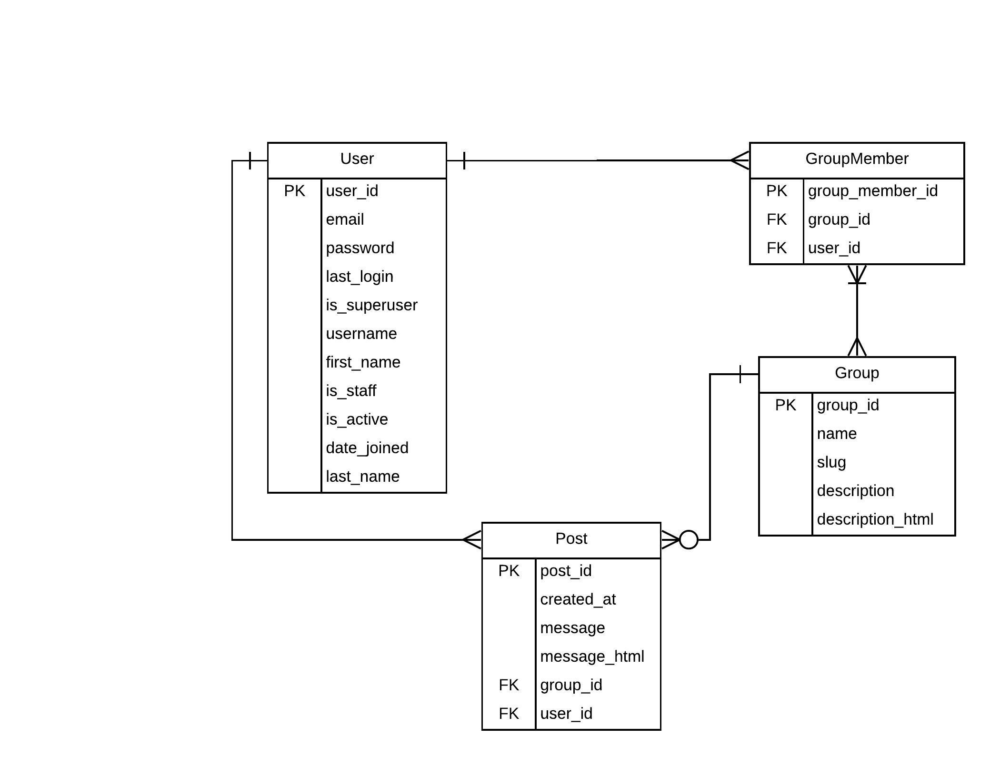

# shohopathi
A platform for sharing knowledge and connecting with fellow students from your university.

#### Introduction
We will be building a web application for university students, where they will be able to share their writings and files related to the courses they have completed or will be completing as a requirement for their graduation. Also, they will be able to hold conversations with other students of their respective universities by commenting under their posts or by messaging them. It will help students to get started with their courses much faster, get direct help from their seniors as well as build a good relationship with other fellow students from their university.

Many a time we have seen students getting frustrated and overwhelmed by the unfamiliar and complex contents of their newly taken courses at the universities and not getting good grades because of it. We have also seen students from the same universities, especially universities with open credit system not being familiar with their seniors or juniors, which often results in a slow start of their job landing experience because of not having enough connection with people who could refer their CVs to their desired companies. Thus, this web application had to be formulated to solve these important issues and provide the students with the long awaited helping hands they deserved.

#### Use Case Diagram

#### Class Diagram

#### Sequence Diagram

#### Activity Diagram

#### E-R Model

#### Relational Model

#### Conclusion
This project will assist in accelerating a student’s performance in their academic studies and getting them to form new connections with fellow students from their respective university for an improved university life experience and job searching experience after graduation. 
